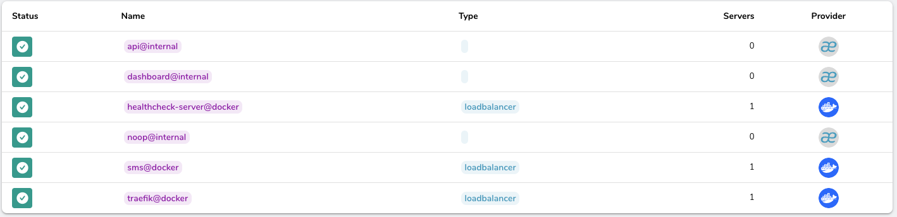

# vcs-sms-microservice

## 1. Overview hệ thống:

- Hệ thống được phân chia thành các servieces như:
  * Healthcheck-server:để nhận request từ các agents.
  * Healthcheck-worker:thực hiện xử lý các request từ **healthcheck-server**, cập nhật các server vừa gửi thông tin, các server hiện thời.
  * Mail: thực hiện xử lý request report từ server-management gửi mail.
  * Server-management: thực hiện CRUD, gửi report hàng ngày.
### 1.1. Healthcheck-server:

- Agent gửi request đến traefik, traefik thực hiện router rồi cân bằng tải, forward request tới đúng instance của service đó.
- Healthcheck-server sẽ thực hiện đẩy thông tin của các agent vào message queue để healthcheck server có thể xử lý.
### 1.2. Healthcheck-worker:

- Healthcheck-worker sẽ thực hiện pull thông tin agent từ message queue, phân phối task cho worker, thực hiện async cập nhật, update server đang tồn tại/chưa tồn tại trong SQL.
- Cập nhật các bản ghi của agent vào elasticsearch phục vụ cho việc tính uptime.
- Cached server vào redis để tăng khả năng truy xuất, có thời gian expired là 10-15 phút.
### 1.3. Server-management:

- Server-management thực hiện các truy vấn phức tạp hơn theo yêu cầu của đề bài.
- Thực hiện gửi request report tới mail bất kì, đẩy thông tin cần gửi kèm mail vào message queue.
- Tính toán uptime trên elasticsearch (đã sửa lại so với checkpoint cũ), cụ thể:
  * Thực hiện tìm kiếm bản ghi có thời gian ngắn nhất trong tất cả các bản ghi trong buckets(sử dụng aggs).
  * Tính toán tổng duration (số lần gửi request lên healthcheck-server).
  * Thực hiện tính up time = (tổng duration) / (time hiện tại - time ngắn nhất).
### 1.4. Mail:

- Nhận được bản ghi từ message queue, mail-service thực hiện gửi mail.

## 2. Thiết lập:
- Thực hiện thiết lập docker swarm trên local: `docker swarm init`
- Có thể join các worker với node manager vừa khởi tạo với token: `docker swarm join --token <token>`
- Thực hiện điền các biến môi trường .env có trong folder **docker_swarm**.
- Thiết lập docker stack có trong file compose bằng cách: `docker stack deploy -c docker-compose.yaml <tên_stack>`
- Để xoá stack sử dụng: `docker stack rm <tên_stack>`.
  
## 3. Thực thi các chức năng:
- Các request giờ đây đều được gửi qua url **http://traefik.local/**
  * Đối với các request tới heathcheck-server sẽ là: **http://traefik.local/healthcheck**
  * Đối với các request tới server-management sẽ là: **http://traefik.local/server-management**
- Router để forward đúng service trên dashboard traefik:
 
- Load balancer(nơi tiếp nhận service sau router) trên dashboard traefik:
 

## 4. Key thay đổi chính:
- Sửa công thức uptime: hiệu quả hơn khi sử dụng aggs thay vì duyệt qua các bản ghi.
- Sử dụng heathcheck-server làm server tập trung để agent gửi request lên, thay vì server phải chủ động đi ping thì agent sẽ gửi thông tin định kì mỗi 30s.
- Phân chia ứng dụng thành các microservice, sử dụng docker swarm để thực hiện chạy các container trên nhiều node.
- Thiết lập traefik để thực hiện nhiệm vụ router, load balancer, server discovery.
